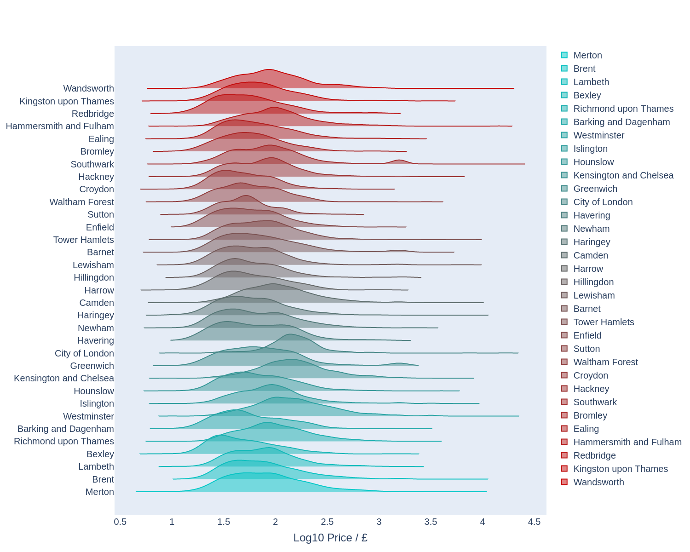

# XXXX take home assignment
## Instructions
- Choose any publically available data source you want (if it’s a personal interest of yours even better)
- With a combination of text and visualisations derive and explain something interesting you’ve found in a manner understandable by a competent but lay audience
- Derive and explain a business value proposition for a predictive model in this space
- Build a V0 and evaluate the results
- Describe how you would further iterate on this model to improve it
- Briefly detail the implementation/productisation concerns you feel are most relevant

## Requirements
- Implemented in Python
- Exploration piece done in Jupyter notebook
- Implementation can take whatever form you’re most comfortable with, but you can use this as an opportunity to demonstrate some more formal software development best practices
- The written answers can take any form you like so long as they’re accessible in an obvious and logical manner

## Data
I'll be using Airbnb listings data for London compiled in December 2021.
- [Data](http://insideairbnb.com/get-the-data/)
- [Data detail dictionary](https://docs.google.com/spreadsheets/d/1iWCNJcSutYqpULSQHlNyGInUvHg2BoUGoNRIGa6Szc4/edit?usp=sharing)
- [London Airbnb visualisation](http://insideairbnb.com/london/)

## Code Repository
- My personal [Github](https://github.com/0zero/LondonAirbnb).

## Data Exploration findings
I'm looking at Airbnb listings data for London, UK and I decided to approach it from the angle of doing some preliminary investigations for a client looking to enter London's Airbnb rental space. The client is unfamiliar with London and other than finding out how much they can charge for a potential property, they'd also like to know which areas are popular with Airbnb users along with the typical price per night in these areas. 

#### What is the typical price per night for Airbnb listings in London?

On average, London’s three most expensive boroughs are _Westminister_ at £258 per night, the _City of London_ at £237 per night, and _Kensington and Chelsea_ at £222 per night (Fig.1 left side). If you know London these findings are pretty unsurprising as these boroughs are very affluent and located right in the heart of London. 

<figure>

<figcaption align = "center"><b>Fig.1 - Mean (left) and median (right) listing price per London borough. </b></figcaption>
</figure>

  However, these averages are only part of the story. London's Airbnb listing prices vary drastically in each borough and simply presenting an average doesn’t do it justice. As you can see in the ridge plot below (Fig.2), the spread of the prices in each London borough is pretty large, with modest listings priced from a few tens of pounds sterling per night to some luxurious listings having prices up to ~£18,000 per night!!! In such a scenario, another type of average - the median, showing the middle value - might be more suitable. This average (Fig.1 right side) also shows above areas as the most expensive but the price per night is around £100 cheaper compared to using the mean as the average. 

<figure>

<figcaption align = "center"><b>Fig.2 - Log10 Price distribution for each London borough. </b></figcaption>
</figure>

#### What are the most popular areas in London for Airbnb users?

The data we’ve got unfortunately does not provide the number of bookings each listing has had since it joined Airbnb so we’re going to use the number of reviews as a proxy for this. The assumption is that most, if not all, guests who stay at a listing will leave a review so if a listing does not have a review it has not been booked before and can be considered inactive.

<figure>

<figcaption align = "center"><b>Fig.3 - Left: Total number of reviews per borough. Right: Total reviews normalised by active listings. </b></figcaption>
</figure>

  The map on the left of Fig.3 shows the total number of reviews per borough. Immediately we can see that the majority of reviews, and by proxy rentals, lie within London’s central areas and the borough with the most reviews is Westminister. A lot of London’s amenities and attractions are within the central area which completely justifies why listings in these boroughs would be the most reviewed/rented in London. Interestingly, the City of London borough has very few reviews but upon closer inspection, we can see that there are only 271 active listings there which are considerably fewer than other nearby boroughs.

If we look at the number of reviews per number of active listings (right of Fig.3), we see that there’s a tendency for the west and central London boroughs to be more active than those in the east. The City of London is now the most popular borough, and unexpectedly in second place is the borough of Hillingdon. Hillingdon’s popularity could be due to London’s Heathrow airport residing there and guests seeking a listing close to the airport and with good transport links into the city.

Overall, visitors to London prefer to stay within the central regions so our investor might want to consider getting a property within London’s travel zones 1 or 2.

## Business Value Proposition

**We help holiday property investors enter new markets by letting you explore how you could make the most of your investment using our custom AI platform.**

This value proposition is for holiday (short-term) property investors who are looking to invest in property in a touristic location to get an idea of what kind of return on investment they could achieve given a particular location, budget, and any property features they feel are must haves. 

This could be achieved using a platform with a predictive model suite that can:
1. Predict rental price per night for various property types and features in various touristic locations
2. Access house purchase prices in those touristic locations
3. Determine based on a clients budget and desired property features, if any, what kind of property and rental price would lead to the best return on investment

The investors could then use the platform to explore numerous possibilities themselves in a user-friendly front-end. 

## V0 Model
I've started off using a Linear and a Random Forest Regression models from Python's Scikit Learn package.

There are some details about decisions made and explorations within the `airbnb.ipynb` notebook and I've also converted some of what's in the notebook into a more productionised form albeit there is still a fair bit of work required to fully productionise the code.  

For the model runs employed I've removed all rows containing missing data in the selected features, which accounts for about 6% of the total data. In the exploration notebook I've replaced missing feature data with the mode of the features as they were mainly categorical. Any missing price rows were removed as price is the target variable in this work. 

### Model results

Overall, the two models used don't perform that well. They have an $R^2 \sim 0.45$ and an $RMSE \sim £90$. You can see from Fig.4 that the model's predictions for prices over $\sim £200$ are consistently undervalued compared to the real values. The linear model performs equally well on the training data as it does on the test data while the Random Forest model performs exceedingly well on the training data but almost identical to the linear model on the test data set. 

<figure>

<figcaption align = "center"><b>Fig.4 - Model predictions versus test data for the linear model. </b></figcaption>
</figure>

 The above results only used listings where the price per night was less than £1000 as a crude way to limit the very luxurious listings. If I used all rows that had no missing data, the resulting $R^2$ is $\sim 0.17$ whilst when I reduced the data further by limiting price per night to £400, I could get $R^2 \sim 0.5$. The listing types and features in the dataset are very different and therefore a pooled model encompassing all the data is probably the wrong approach here and I could probably get better results by creating separate focused models for particular types of listings including luxurious properties or properly accounting for luxurious properties as outliers. 

### Model Improvements
The models created here aren't particularly useful yet but here's a list of changes/updates that I think could lead to some improvements:
- Implement models for each property type e.g. `entire apartment/house`, `private room`, etc. This would focus the model as you can imagine that treating a 5 bedroom house the same as a shared room is not the best approach.
- Create a hierarchical Bayesian model with the same idea as above but instead of having X-different models, it's one that can account for all room types, or any other feature that we feel can be thought of as hierarchical. 
- Perform a GridSearchCV on each possible model to obtain the "best" model parameters that we search through
- More feature engineering. In this model it's been pretty basic so far. 
- Perhaps use of mutual information instead of Pearson's correlation coefficient to select features that have influence on the price
- Fit various regressor models to the data. Then perform model comparison and select the one that performs best on new/unseen data.
- Use models that can be regularised and compare with unregularised models like ordinary least squares.
- There are many different listings with the same or similar price per night so it would be wise to investigate this further and discuss with clients about being more selective with the data we use for modelling. So basically, being focused on what we want our model to be good at predicting.

### Implementation / Productisation concerns
The following are a few implementation and productionisation concerns that should be addressed during the development cycle:
- code linting/type checking e.g. with black, flake8, and mypy 
- unit and integration tests 
- model reproducibility tests to ensure the model can reproduce predictions when it's retrained so we can catch any model drifting. 
- Training automation so the model can be trained automatically and updated when new data are available
- Automate the deployment and testing of model
- Automate scaling of infrastructure that model runs on
- Monitor model infrastructure, model functionality, outputs and have alerts for when issues occur.
